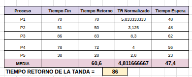
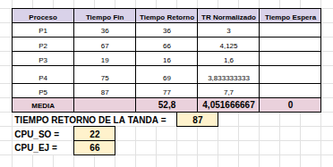
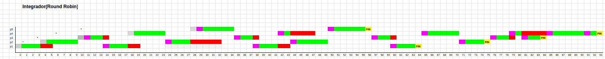

# Diagramas del Proyecto

Diagramas mas detallados en el drive: **[Diagramas](https://docs.google.com/spreadsheets/d/1qHATpGeeqmRVozamvI7d8yzLMBB78Wa8RlS95k7b-VU/edit?gid=0#gid=0)**

Teniendo en cuenta el siguiente conjunto de datos (`procesos_tanda_5p.json`)

#### FCFS

#### SPN

#### SRTN

#### Round Robin

#### Prioridad Externa

